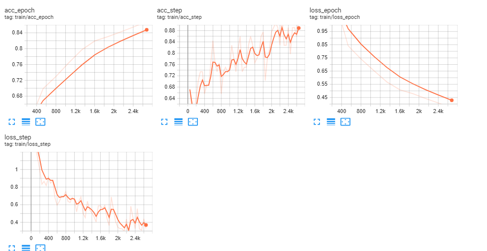
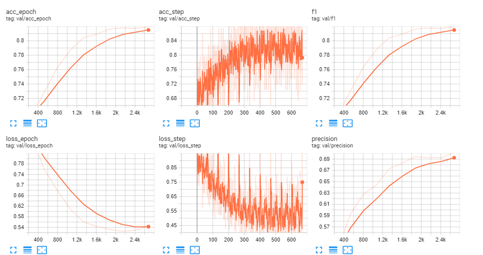
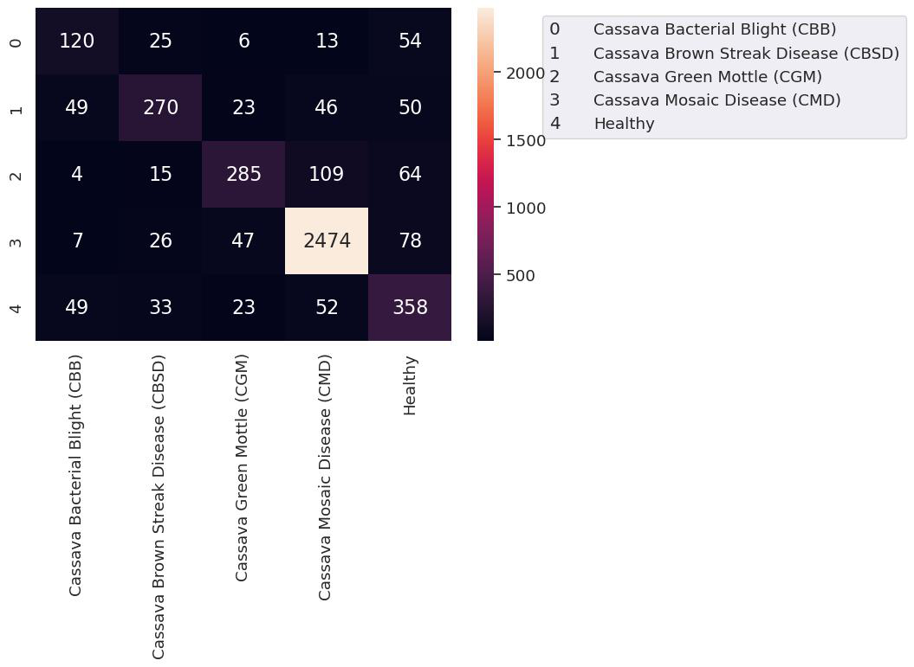

# Cassava Leaf Classification

Can you identify a problem with a cassava plant using a photo from a relatively inexpensive camera? This competition will challenge you to distinguish between several diseases that cause material harm to the food supply of many African countries. In some cases the main remedy is to burn the infected plants to prevent further spread, which can make a rapid automated turnaround quite useful to the farmers.

**About Dataset**
* [train/test]_images the image files. The full set of test images will only be available to your notebook when it is submitted for scoring. Expect to see roughly 15,000 images in the test set.

**train.csv**

* `image_id` the image file name.

* `label` the predicted ID code for the disease.

There are 5 classes of labels: ['Cassava Bacterial Blight (CBB)', 'Cassava Brown Streak Disease (CBSD)',
             'Cassava Green Mottle (CGM)', 'Cassava Mosaic Disease (CMD)', 'Healthy']


## Output and Analysis


### Logs

**Hyperparameters**
```yaml
learning_rate: 1.2e-05
model_name: regnetz_c16
num_classes: 5
optimizer_name: ADAM
```
**Training**


Checkout full logs in Tensorboard Dev: https://tensorboard.dev/experiment/rXpGPVwXTgGDoRau1xWXCg

Or Run Tensorboard logs locally as: `tensorboard --logdir="files/outputs"`

**Validation**


### Confusion Matrix


### Confusion Matrix

See the full [notebook](cassavaleafclassification.ipynb) for more details.
