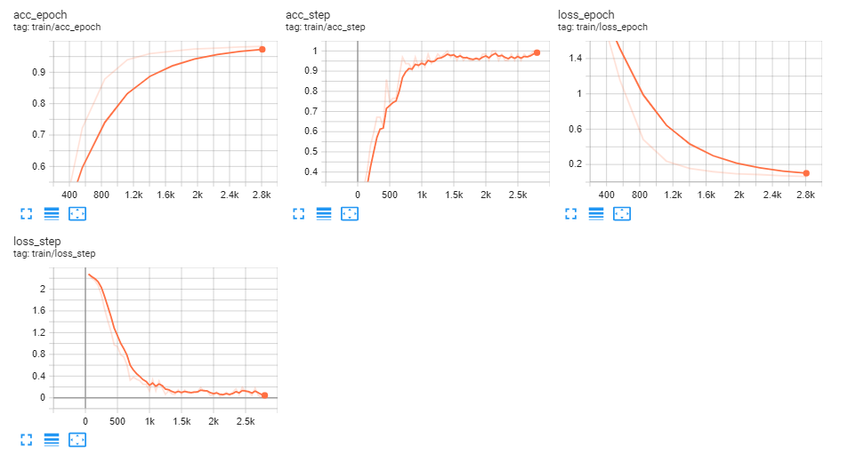
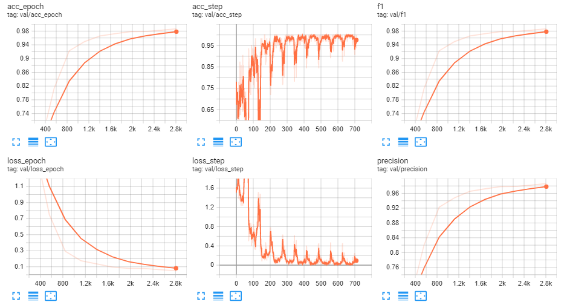
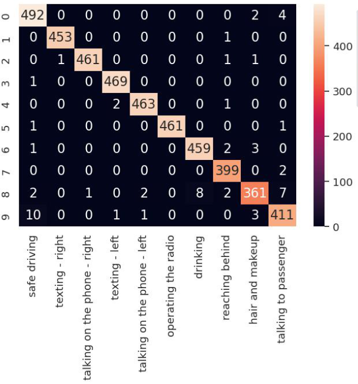

## State Farm Distracted Driver Detection


### Overview
Can computer vision spot distracted drivers?

State Farm hopes to improve these alarming statistics, and better insure their customers, by testing whether dashboard cameras can automatically detect drivers engaging in distracted behaviors. Given a dataset of 2D dashboard camera images, State Farm is challenging Kagglers to classify each driver's behavior. Are they driving attentively, wearing their seatbelt, or taking a selfie with their friends in the backseat?

**Kaggle Competition Link: https://www.kaggle.com/competitions/state-farm-distracted-driver-detection**


## Output and Analysis


### Logs

**Hyperparameters**
```yaml
learning_rate: 1.2e-05
model_name: regnetz_c16
num_classes: 10
optimizer_name: ADAM
```
**Training**


Checkout full logs in Tensorboard Dev: https://tensorboard.dev/experiment/5X09orn0TDCr1AsDo3GRYA/

**Validation**


### Confusion Matrix



### Confusion Matrix

See the full [notebook](pytorchlightning-state-driver-detection.ipynb) for more details.